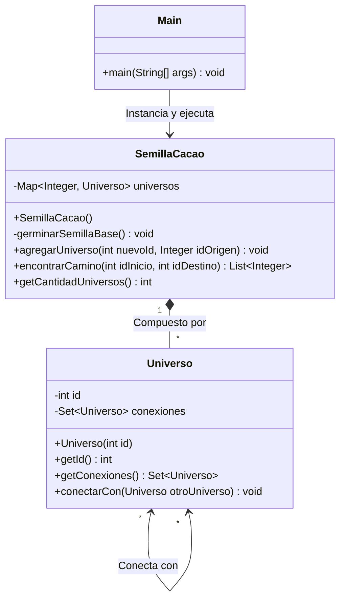

# Multiverso Estructura de Datos Semilla de Cacao
Este repositorio contiene la implementación en Java de una estructura de datos personalizada que simula un "Multiverso" interconectado. La topología de este multiverso está inspirada en la morfología de una **Semilla de Cacao**.

## 📌 Características Principales

*   La estructura base nace como un grafo conexo, garantizando que siempre exista al menos un camino entre dos nodos cualesquiera.
*   Al instanciarse el objeto principal, el sistema genera automáticamente 32 nodos base (universos).
*   Cada nuevo universo se ancla aleatoriamente a uno preexistente durante la inicialización para evitar islas o nodos aislados.
*   Se emplea un algoritmo BFS (Búsqueda en Anchura) para calcular la ruta de "saltos cuánticos" más corta entre dos universos.
*   Las conexiones operan como portales bidireccionales, permitiendo el viaje de ida y vuelta de manera consistente.

---

## 🏗️ Arquitectura y Diagrama de Clases (UML)

El siguiente diagrama ilustra la relación estructural entre los componentes de la Semilla de Cacao:

---

## 📂 Descripción de Clases

### 1. `Universo.java`
Representa un nodo individual (o realidad) dentro del multiverso.
*   Posee un identificador único numérico (`id`).
*   Utiliza un `HashSet` para gestionar sus adyacencias, lo que garantiza que no existan portales duplicados hacia un mismo universo.
*   El método `conectarCon` se encarga de establecer un enlace recíproco entre la instancia actual y el universo de destino.

### 2. `SemillaCacao.java`
Es la clase gestora (el grafo principal) que administra el tejido del multiverso.
*   Utiliza un diccionario (`HashMap`) para almacenar la red, permitiendo un acceso instantáneo a cualquier universo mediante su ID.
*   En su constructor, ejecuta `germinarSemillaBase()`, método responsable de crear el Universo Origen (0) y los siguientes 31 universos de la base geométrica.
*   El método `agregarUniverso()` previene violaciones estructurales lanzando una excepción `IllegalArgumentException` si se intenta crear un universo aislado que no provenga del nodo raíz.
*   El método `encontrarCamino()` implementa una cola (`LinkedList`) y un registro de visitados (`HashSet`) para explorar el grafo por niveles y retornar la ruta exacta de IDs entre dos puntos.

### 3. `Main.java`
Es el punto de entrada y demostración del sistema.
*   Instancia la clase `SemillaCacao` e imprime un mensaje verificando la creación de los 32 universos.
*   Simula la expansión del multiverso conectando explícitamente el universo 32 al 15, y el 33 al 32.
*   Pone a prueba el sistema de navegación solicitando calcular e imprimir la ruta desde el nodo de origen (0) hasta el nodo recién creado (33).

---

